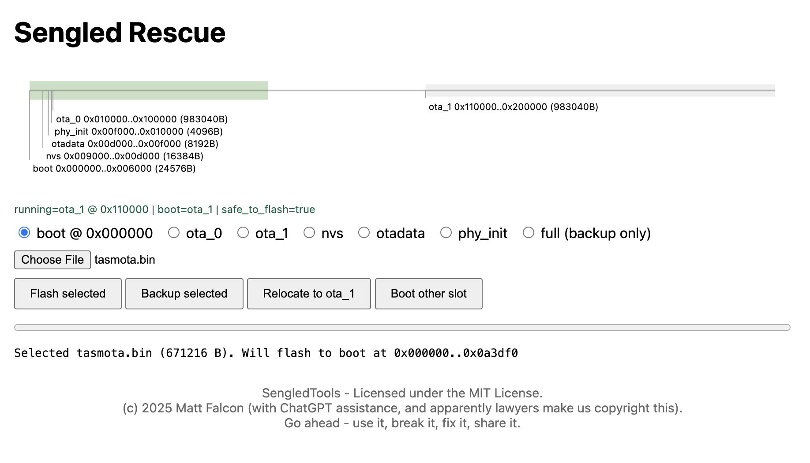

# Sengled Wi-Fi Bulb Local Control & Setup Tool

**Sengled's original cloud backend is no longer operational. This repository exists to provide fully local alternatives.**

A comprehensive tool for local control and protocol research of Sengled Wi‑Fi bulbs. It can pair bulbs to your own MQTT broker, provides UDP control, and includes firmware flashing capability to install open source firmware like Tasmota or WLED.

## TL;DR (what this repo is)

This repo provides multiple **local control paths** for Sengled Wi‑Fi bulbs. There are three tracks:

> [!TIP]
> **Start with the Home Assistant integration** - it's the simplest option requiring no flashing or MQTT setup. Only proceed with flashing if you need features not available via local UDP control. If you want Alexa integration without Home Assistant, flash WLED firmware.

- **Home Assistant (recommended for most)**: use the built-in **local UDP** custom integration to add bulbs as `light` entities (no cloud, no flashing). See **[Home Assistant (Local UDP Integration)](#home-assistant-local-udp-integration)**.
- **CLI tool / protocol research**: use `sengled_tool.py` to send UDP/MQTT commands, pair bulbs to a local broker, and inspect behavior.
- **Flashing (optional)**: install open firmware (Tasmota/ESPHome/WLED) on compatible hardware if you want to completely replace Sengled's stack. After flashing, bulbs can be controlled directly (web UI) and integrate cleanly with Home Assistant (via Tasmota/MQTT) or Alexa (via WLED Hue emulation).

## Quick Navigation

- **[Quick Start](#quick-start)** - Easiest setup for most users
- **[Factory Reset Procedures](docs/RESET_PROCEDURES.md)** - Visual reset steps for devices
- **[Flashing Information](#flashing-information)** - Flash Tasmota/ESPHome/WLED
- **[Command Reference](#command-reference)** - Complete CLI help and options
- **[FAQ](#faq)** - Frequently asked questions
- **[Wi-Fi Setup Sequence](#wi-fi-setup-sequence)** - Technical pairing details
- **[Advanced Instructions](docs/INSTRUCTIONS_ADVANCED.md)** - Detailed troubleshooting and advanced usage
- **[Home Assistant (Local UDP Integration)](custom_components/sengled_udp/README.md)** - Use bulbs in Home Assistant without cloud


## Quick Start

> [!NOTE]
> Before starting, make sure you have:
> - A computer on the same WiFi network as the bulb (for local communication)
> - Python 3.10+ installed
> - Your bulb factory reset and ready to pair

First, clone the repo:
```bash
git clone https://github.com/HamzaETTH/SengledTools.git
cd SengledTools
```

### 1. Prepare the Bulb
1. **Factory Reset the Bulb**: Flick the power switch rapidly 5+ times until the bulb flashes. See [Factory Reset Procedures](docs/RESET_PROCEDURES.md) for details.
2. **Have the bulb ready to pair**: You can connect to the bulb's AP (`Sengled_Wi‑Fi Bulb_XXXXXX`) now, or you can start the wizard first and connect when it tells you to.

### 2. Launch the Wizard

#### Windows
1. Install Python 3.10+ from [python.org](https://www.python.org/downloads/)
2. Double-click `run_wizard.bat` to start. It will auto-run setup if needed.
3. Optional: run `setup_windows.bat` directly if you want to preinstall deps.

#### Linux / macOS
1. Install Python 3.10+ via your package manager.
2. Run: `chmod +x *.sh && ./run_wizard.sh` (auto-runs `./setup_unix.sh` if needed)
3. Optional: run `./setup_unix.sh` directly if you want to preinstall deps.

### Manual install
Install Python 3.10+ and the dependencies:
```bash
pip install -r requirements.txt
python sengled_tool.py --setup-wifi
```

### 3. Follow on-screen prompts
Follow the prompts — when asked, switch your PC to the bulb's Wi‑Fi (`Sengled_Wi‑Fi Bulb_XXXXXX`) and the wizard will continue.


## Flashing information

> [!CAUTION]
> **Flashing firmware carries risk of permanently bricking your bulb.** Only proceed if you understand and accept this risk. The flashing process has been tested with specific bulb models (W31-N15, W31-N11), but other models may not be compatible.

It is possible to reflash compatible Sengled bulbs (see compatibility list) with open-source firmware like [Tasmota](https://tasmota.github.io/), ESPHome, or [WLED](https://kno.wled.ge/). The process to download an arbitrary firmware involves using a "shim" app known as Sengled-Rescue, which is located in the sengled-ota folder of the project. A compiled version of Sengled-Rescue is located at `firmware/shim.bin`.

Once you've completed Wi-Fi pairing and confirmed that sengled_tool.py can communicate with the bulb (sending basic on/off commands), you're ready to proceed. The script will prompt you to flash the firmware.

It uses --upgrade to push the Sengled-Rescue shim firmware.
```
python sengled_tool.py --mac E8:DB:8A:AA:BB:CC --upgrade "firmware/shim.bin"
```

The script will display explicit warnings to confirm you understand the risks. At this time, download and unzip the [Tasmota OTA bin firmware](https://ota.tasmota.com/tasmota/release/) or compile one for ESPHome. For basic usage of the setup_tool script, proceed with the default firmware path. Once the bulb has accepted the shim, the script will finish, but **you're not done yet**.

Look for the Sengled-Rescue Wifi network and join it. Then navigate to http://192.168.4.1 in a browser. It will be slow, so be patient and refresh until it loads.



1. Optional, but recommended: make a full backup of the chip. Select full > backup selected.
2. Select boot > choose file (pick the Tasmota or ESPHome bin) > flash selected

The bulb will accept the update and reboot. It may flash different colors and will take a few minutes. For Tasmota, once an RGBW bulb has been setup, it will do a slow red blink to indicate it needs to be connected to Wifi. To do so, connect to the `tasmota_XXXXXX-####` Wifi network and visit http://192.168.4.1 to set up the credentials. Then you can control the device by visiting its IP address—found on the connection page or by checking which devices are connected to your router.

The **flashing process** has been tested with **W31-N15 and W31-N11** bulbs, which use Sengled's WF863 module (based on ESP8266EX). **Other bulbs appear to use other modules** (like WF864, based on MX1290 chip), which may not work with the flashing process. Basic MQTT/UDP control works on most, if not all, Sengled Wi-Fi bulbs, even when flashing is not supported.

### Currently Known Working Bulbs ✅

> [!IMPORTANT]
> **Flashing only works with ESP8266EX-based modules** (WF863). Other modules like WF864 (MX1290 chip) or EMW3091 are not flashable via this method, though basic MQTT/UDP control still works.

* **W31-N15** (WiFi multi-color LED) - WF863 Module / Espressif ESP8266EX chip
* **W31-N11** (WiFi multi-color LED) - WF863 Module

### Currently Known NON-Working Bulbs ❌

* **W12-N15** (WiFi white LED) - WF864 module / MXCHIP MX1290 chip
* **W21-N13** and **W11-N13** (WiFi multi-color LED) - MXCHIP EMW3091 module / unknown chip


> [!NOTE]
> **Check your bulb's FCC ID** - Look on the side of your bulb for the FCC ID. It identifies the module/chip inside and tells you if flashing is supported. Report new working models via GitHub issues!

---


### Tasmota Templates

When flashing Tasmota firmware to your Sengled bulbs, use these device templates by [importing in the web UI](https://tasmota.github.io/docs/Templates/#importing-templates):

#### W31-N15 (RGBW Bulb)

```json
{"NAME":"Sengled RGBW","GPIO":[0,0,0,0,0,0,0,0,417,416,419,418,0,0],"FLAG":0,"BASE":18}
```

**Reference:** [Sengled W31-N15 Template](https://templates.blakadder.com/sengled_W31-N15.html)

#### W31-N11 (White Bulb)

```json
{"NAME":"Sengled W31-N11","GPIO":[0,0,0,0,416,0,0,0,0,0,0,0,0,0],"FLAG":0,"BASE":18}
```

These templates configure the correct GPIO pins for PWM control of the LED channels.


### Tasmota PWM Cheatsheet

Quick PWM commands for brightness control in the Tasmota console (for Sengled W31-N11):

- **Off:** `PWM1 0`
- **25%:** `PWM1 256`
- **50%:** `PWM1 512`
- **100%:** `PWM1 1023`


### WLED Firmware

> [!TIP]
> **Best option for direct Alexa integration** - WLED's Hue emulation lets you control Sengled bulbs through Alexa without any Home Assistant instance or MQTT broker. Perfect if you just want your bulbs working with Alexa.

WLED firmware has been successfully tested and confirmed working on Sengled bulbs with ESP8266EX chips. WLED provides a plug-and-play option with **direct Alexa integration** via Hue emulation, requiring no additional MQTT broker or Home Assistant instance.

**Source:** Based on community testing reported in [issue #37](https://github.com/HamzaETTH/SengledTools/issues/37).

#### WLED Configuration

**LED output mode:** PWM RGBW

#### GPIO Pinouts

##### W31-N15
```
GPIO pins: 13, 12, 15, 14
```

##### W31-N13H
```
GPIO pins: 12, 15, 13, 4
```

#### Setting Up Alexa Integration (Hue Emulation)

1. In WLED, navigate to **Settings → Sync Interfaces → Alexa Voice Assistant**
2. Enable **"Emulate Alexa device"**
3. Set the invocation name (what you want the bulb to show as in Alexa)
4. Click **Save**

Then from your phone:
1. Open the Alexa app
2. Select **"Add device"** → **Light**
3. When asked for manufacturer, select **Philips Hue**
4. Click **"Yes"** when prompted "Is this device Bluetooth enabled"
5. Wait for discovery (may take a few minutes)
6. Your WLED/Sengled bulb should now appear in the Alexa app


## Command Reference

### Help Output

```bash
python sengled_tool.py --help
```

**Usage:** For simple usage, simply run the tool without arguments.
```
usage: sengled_tool.py [-h] [--setup-wifi] [--broker-ip BROKER_IP] [--broker-port BROKER_PORT]
                       [--ca-crt CA_CRT] [--server-crt SERVER_CRT] [--server-key SERVER_KEY] [--ssid SSID]
                       [--password PASSWORD] [--embedded] [--regen-certs] [--status] [--mac MAC] [--on]   
                       [--off] [--toggle] [--brightness BRIGHTNESS] [--color R G B]
                       [--color-temp COLOR_TEMP] [--reset] [--custom-payload CUSTOM_PAYLOAD]
                       [--upgrade UPGRADE] [--group-macs GROUP_MACS [GROUP_MACS ...]]
                       [--group-switch {on,off}] [--group-brightness GROUP_BRIGHTNESS]
                       [--group-color-temp GROUP_COLOR_TEMP] [--gradient-time GRADIENT_TIME]
                       [--effect-status EFFECT_STATUS] [--ip IP] [--udp-on] [--udp-off]
                       [--udp-brightness UDP_BRIGHTNESS] [--udp-set-color R G B] [--udp-json UDP_JSON]
                       [--topic TOPIC] [--payload PAYLOAD] [--force-flash] [--run-http-server]
                       [--run-servers] [--http-port HTTP_PORT] [--http-server-ip HTTP_SERVER_IP]
                       [--verbose]

Sengled Local Control Tool

options:
  -h, --help            show this help message and exit
  --setup-wifi          Start interactive Wi-Fi setup.
  --broker-ip BROKER_IP
                        IP address of your MQTT broker (defaults to this PC's local IP if omitted).
  --broker-port BROKER_PORT
                        MQTT broker port (default: 8883).
  --ca-crt CA_CRT       Path to CA certificate (default: ca.crt)
  --server-crt SERVER_CRT
                        Path to server certificate (default: server.crt)
  --server-key SERVER_KEY
                        Path to server private key (default: server.key)
  --ssid SSID           Wi-Fi SSID for non-interactive setup.
  --password PASSWORD   Wi-Fi password for non-interactive setup.
  --embedded            Force control publishes to 127.0.0.1:8883 (embedded broker). Not used for Wi-Fi setup.
  --regen-certs         Force regeneration of TLS certificates in the unified location.
  --status              Send status command (no payload)
  --force-flash         Allow flashing even if model/module is not recognized as supported.
  --run-http-server     Run the Sengled local server only (for firmware update testing).
  --run-servers         Start embedded MQTT broker and HTTP server for bulb control.
  --http-port HTTP_PORT
                        HTTP server port (default: 8080).
  --http-server-ip HTTP_SERVER_IP
                        IP/host to embed in HTTP URLs sent to the bulb (defaults to LAN IP).
  --verbose             Show debug + error logs

Bulb Control (MQTT):
  --mac MAC             MAC address of the bulb to control.
  --on                  Turn the bulb on.
  --off                 Turn the bulb off.
  --toggle              Toggle the bulb's power state.
  --brightness BRIGHTNESS
                        Set brightness (0-100).
  --color R G B         Set color (0-255 for each).
  --color-temp COLOR_TEMP
                        Set color temperature (0-100 percent; 0=2700K, 100=6500K).
  --reset               Reset the bulb.
  --upgrade UPGRADE     Send firmware upgrade command with URL.
  --custom-payload CUSTOM_PAYLOAD
                        Send custom JSON payload to bulb.
  --topic TOPIC         Custom MQTT topic to publish to.
  --payload PAYLOAD     Custom payload to send (raw string, not JSON).


UDP Control (Local Network):
  --ip IP               IP address of the bulb for UDP control.
  --udp-on              Turn the bulb on via UDP.
  --udp-off             Turn the bulb off via UDP.
  --udp-brightness UDP_BRIGHTNESS
                        Set brightness via UDP (0-100).
  --udp-set-color R G B     Set color via UDP (0-255 for each).
  --udp-json UDP_JSON   Send a custom JSON payload via UDP.

> [!WARNING]
> The following group control commands are untested and may not work correctly. Use at your own risk.
  --group-macs GROUP_MACS [GROUP_MACS ...]
                        List of MAC addresses for group control.
  --group-switch {on,off}
                        Control multiple bulbs on/off.
  --group-brightness GROUP_BRIGHTNESS
                        Set brightness for multiple bulbs (0-100).
  --group-color-temp GROUP_COLOR_TEMP
                        Set color temperature for multiple bulbs.
  --gradient-time GRADIENT_TIME
                        Transition time for group commands (default: 10).
  --effect-status EFFECT_STATUS
                        Set effect status (0=off, 7=audio sync, 100=video sync, 101=game sync).
```


## FAQ

<details>
<summary>I'm able to set up the Wifi connection on the bulb, but verification times out.</summary>

> [!IMPORTANT]
> **Your bulb cannot communicate with your computer.** This is almost always a network isolation or firewall issue.

Check the following:
 - Your computer is on the **same WiFi network** as the bulb
 - Your WiFi network allows devices to see each other (AP isolation disabled)
   - Log into your router at http://192.168.0.1/ to check this setting
 - Your firewall isn't blocking the connections

**Troubleshooting step:** Visit `http://yourlocalIP:57542/jbalancer/new/bimqtt` from another device on the same network. If it returns text, network is OK. If not, fix network settings first.
</details>

<details>

<summary>Can I use this with Home Assistant?</summary>

> [!TIP]
> **Yes, and it's the recommended option!** The local UDP integration requires no cloud, no MQTT broker, and no flashing. Just add the custom component and you're done.

**Yes.** This repo includes a **local-only Home Assistant custom integration** that controls Sengled Wi‑Fi bulbs directly over **UDP** (no cloud).

- Setup + details: [custom_components/sengled_udp/README.md](custom_components/sengled_udp/README.md)
- Notes: it **does not pair** bulbs for you; it assumes the bulb is already on your LAN and reachable on UDP port 9080.

</details>

<details>
<summary>Will this make my bulbs work with Google Home?</summary>

* **Yes, with Home Assistant:** You can integrate with Google Home through Home Assistant's Google Assistant integration.
</details>

<details>
<summary>I don't use Home Assistant. Can I still control bulbs?</summary>

> [!TIP]
> **For Alexa users:** Flash WLED firmware for direct Alexa integration via Hue emulation. It's plug-and-play with no Home Assistant or MQTT broker needed.

Yes, you have options:
 - **Local UDP/MQTT:** Use the documented MQTT or UDP commands (requires `--run-servers`)
 - **Tasmota/ESPHome:** Flash open firmware and use the web interface
 - **WLED:** Flash WLED for direct Alexa control via Hue emulation

</details>

## Home Assistant (Local UDP Integration)

If you use Home Assistant and just want local control, you can skip MQTT and firmware flashing and use the custom integration included here:

**Setup instructions**: [custom_components/sengled_udp/README.md](custom_components/sengled_udp/README.md)

What it does:
- Creates one `light` entity per bulb
- Supports **RGB bulbs** and **white-only bulbs** (white bulbs won't show RGB controls)
- Can **discover bulbs on the LAN** (best-effort via UDP broadcast) or let you enter IPs manually
- Requires bulbs reachable on **UDP port 9080** (same LAN/VLAN, no firewall blocks)

## Wi-Fi Setup Sequence

The Wi-Fi pairing process follows a specific sequence of UDP commands and HTTP requests. See [WIFI_PAIRING_REFERENCE.md](docs/references/WIFI_PAIRING_REFERENCE.md) for the complete sequence diagram and technical details.

## Next Steps

For detailed troubleshooting and advanced usage, see [Advanced Instructions](docs/INSTRUCTIONS_ADVANCED.md).
